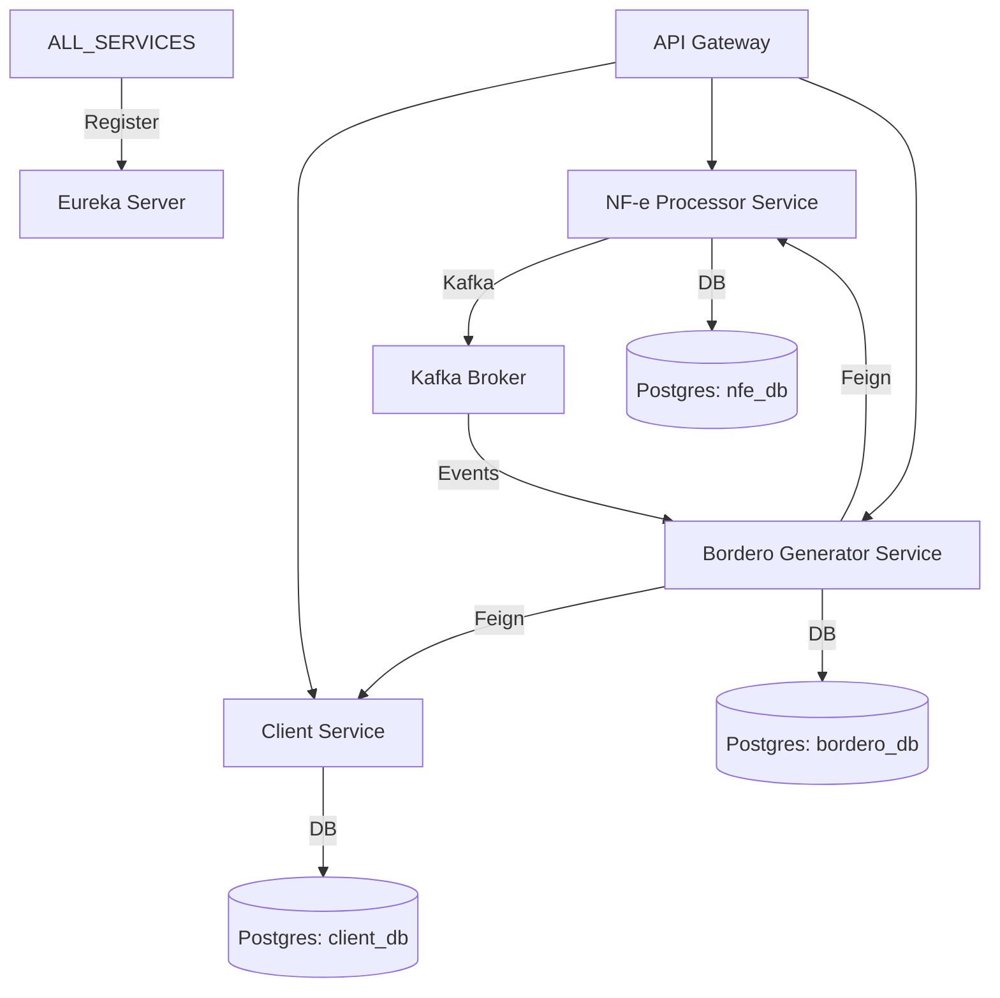

# Project Architecture — nfe-bordero-system

> Sistema de Processamento de NF-e e Geração de Borderôs de Desconto — 2026.5.20

---

## 📋 Visão Geral

O **nfe-bordero-system** é uma solução baseada em microsserviços para o processamento de Notas Fiscais Eletrônicas (NF-e) e a geração automatizada de borderôs de desconto financeiro. O sistema utiliza uma arquitetura moderna e escalável, integrando mensageria assíncrona e descoberta de serviços.

---

## 🏗️ Estrutura de Microsserviços

O sistema é composto pelos seguintes componentes principais:

| Serviço | Descrição | Porta |
| :--- | :--- | :--- |
| `api-gateway` | Ponto de entrada único, roteamento dinâmico e stripping de prefixos. | 8080 |
| `eureka-server` | Servidor de descoberta Netflix Eureka para registro dinâmico de instâncias. | 8761 |
| `client-service` | Gerenciamento de dados de clientes e autenticação (JWT). | 8084 |
| `nfe-processor` | Processamento de NF-e, integração com Kafka. | 8081 |
| `bordero-generator` | Core business logic para geração de borderôs (PDF) e agregação de dados. | 8082 |

---

## 🛠️ Tech Stack

### Backend & Core
- **Framework:** Java 21 + Spring Boot 3.2.0
- **Service Discovery:** Netflix Eureka
- **API Gateway:** Spring Cloud Gateway
- **Inter-service Communication:** OpenFeign (Síncrona) & Spring Kafka (Assíncrona)
- **PDF Generation:** OpenPDF (LibrePDF)

### Infraestrutura & Dados
- **Database:** PostgreSQL (Instâncias separadas por serviço: `nfe_db`, `bordero_db`, `client_db`)
- **Message Broker:** Apache Kafka (Confluent cp-kafka)
- **Containerization:** Docker & Docker Compose
- **Orchestration:** Kubernetes (Arquivos manifestos disponíveis)

---

## 🔄 Fluxo de Dados e Interações



---

## 🧩 Detalhes dos Componentes

### API Gateway
- Centraliza o acesso externo via `/api/**`.
- Remove o prefixo da API e encaminha para o serviço correspondente via Load Balancer (Eureka).

### NF-e Processor
- Responsável por validar e processar arquivos de NF-e.
- Emite eventos para o tópico `nfe-events` no Kafka para notificar outros serviços sobre novos processamentos.

### Bordero Generator
- O serviço mais complexo do sistema.
- Agrega informações do cliente via `client-service`.
- Consulta dados de NF-e via `nfe-processor-service`.
- Gera documentos PDF customizados usando a biblioteca OpenPDF.

---

## 🚀 Como Executar

O sistema pode ser iniciado localmente usando Docker Compose:

```bash
docker-compose up -d
```

As ordens de dependência (`depends_on`) garantem que o banco de dados, o Kafka e o Eureka estejam saudáveis antes de iniciar os serviços de aplicação.
